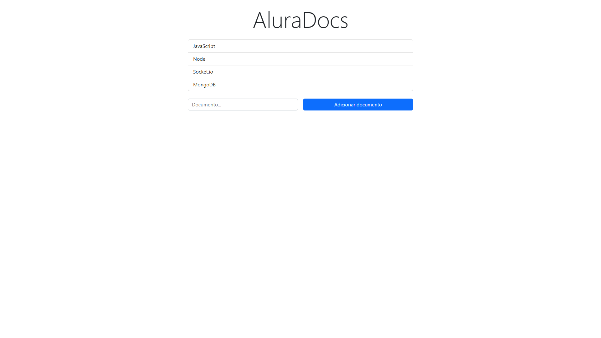
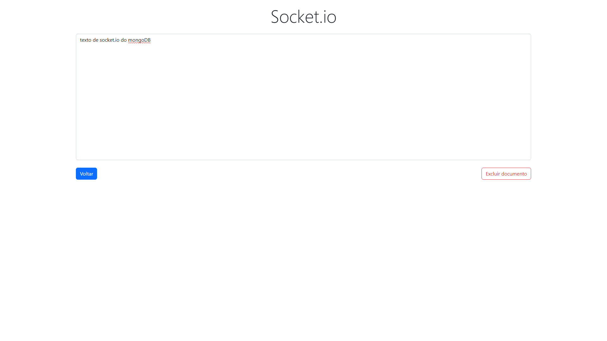

# 📑 AluraDocs – Editor de Documentos Colaborativo

Aplicação fullstack de edição de documentos em tempo real, utilizando **Node.js**, **Express**, **Socket.io** e **MongoDB**.  
Permite criar, editar e excluir documentos compartilhados entre vários usuários conectados simultaneamente.

---

## 🚀 Tecnologias utilizadas
- **Frontend**:  
  - HTML5  
  - CSS (Bootstrap 5)  
  - JavaScript (ESModules)  
  - Socket.io Client  

- **Backend**:  
  - Node.js  
  - Express  
  - Socket.io  
  - MongoDB (Atlas)

---

## 📂 Estrutura do projeto
```
📦 projeto
├── public/               # Arquivos estáticos
│   ├── index.html         # Página inicial (lista documentos)
│   ├── documento.html     # Página de edição
│   ├── index.js           # Lógica da página inicial
│   ├── documento.js       # Lógica da página de edição
│   ├── socket-front-index.js
│   ├── socket-front-documento.js
├── servidor.js            # Configuração do servidor Express + Socket.io
├── socket-back.js         # Eventos WebSocket no backend
├── dbConnect.js           # Conexão com MongoDB
├── documentosDb.js        # CRUD no banco de dados
```

---

## ⚙️ Funcionalidades
- 📄 **Criar documentos**: Adicione um novo documento pelo formulário.  
- ✍️ **Editar em tempo real**: Alterações são refletidas para todos os usuários conectados.  
- 🗑️ **Excluir documentos**: Remove do banco e da interface de todos os usuários.  
- 🔄 **Sincronização automática**: Sempre que alguém edita, todos veem as mudanças.  

---

## 🛠️ Instalação e uso
1. **Clonar o repositório**
   ```bash
   git clone https://github.com/nalandasouza/learning-websockets.git
   ```

2. **Instalar dependências**
   ```bash
   npm install
   ```

3. **Configurar banco de dados**
   - Crie um cluster no **MongoDB Atlas**  
   - Atualize a string de conexão em `dbConnect.js`

4. **Rodar o servidor**
   ```bash
   npm start
   ```
   O servidor estará disponível em: **http://localhost:3000**

---

## 🌐 Fluxo de uso
1. Abra `http://localhost:3000`  
2. Crie um documento na página inicial  
3. Clique no documento para abrir o editor  
4. Compartilhe o link com outros usuários para editar em conjunto  

---

## 📸 Capturas de tela



